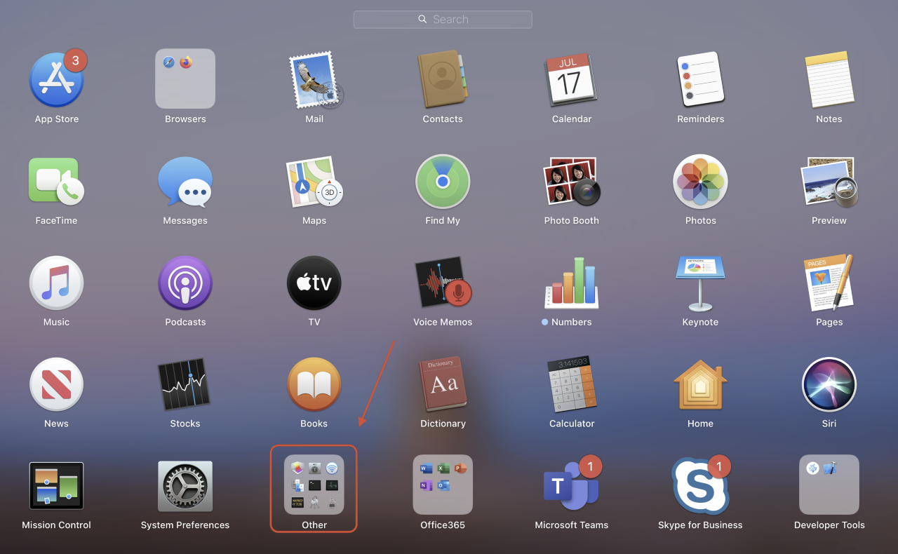
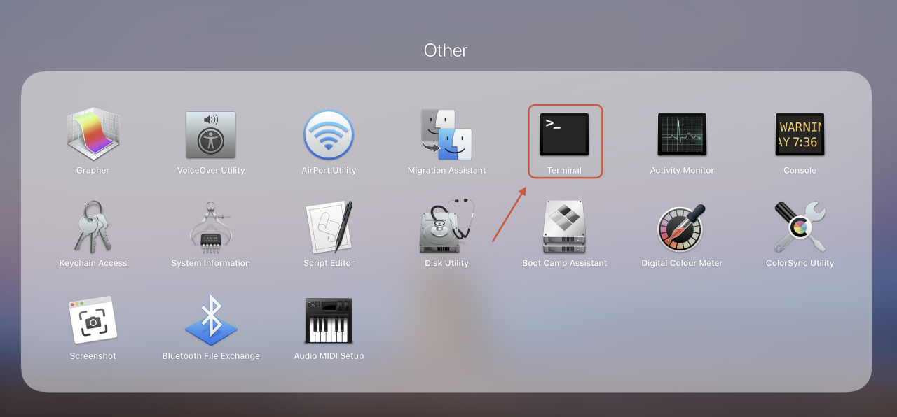
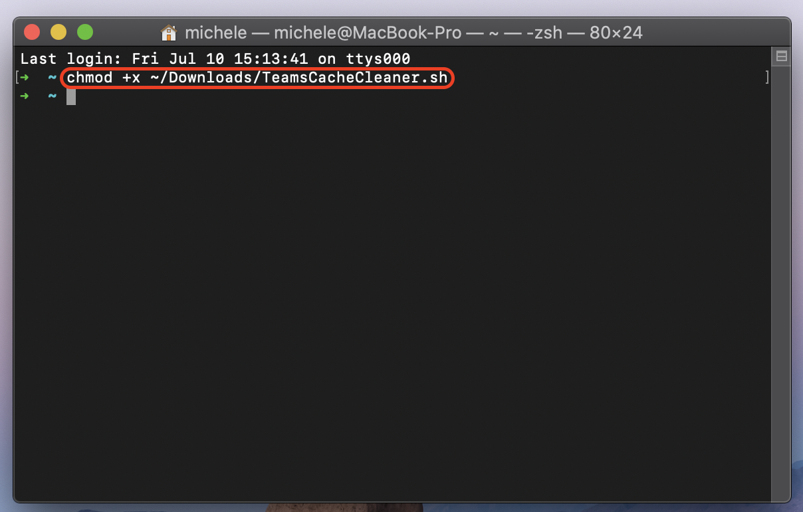

# Instructions

Since MS Teams is currently experiencing several glitches, I decided to write a small script to automate the cache cleaning process and get rid of them.
This script works only on macOS.
There is no need to quit the app before to run the tool, as it automatically kills any Teams process.

Make sure to download the script in __~/Downloads__, as the commands in the instructions refer to that folder.

__0.__ Download the script :)

__1.__ Click on the __Launchpad__ icon, available on the dock.

__2.__ Click on the "__Other__" folder and successively select the Terminal app.

__3.__ Paste the following command into the Terminal window and press [ENTER].

__chmod +x ~/Downloads/TeamsCacheCleaner.sh__

__4.__ Run the script by pasting the following command into the Terminal window and pressing [ENTER] again.
       After a few seconds, the message "Press any key to exit..." should appear.
    
__./Downloads/TeamsCacheCleaner.sh__

__5.__ The application will restart automatically.
